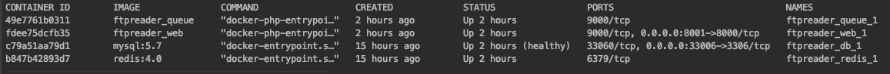

<p align="center"></p>

## 📚 About Ftpreader

Simple data reader on ftp server.


## 🔧 Usage
Laravel's Flysystem integrations works great with FTP; however, a sample configuration is not included with the framework's default filesystems.php configuration file. If you need to configure a FTP filesystem, you may use the example configuration below:

```php
'ftp' => [
    'driver'   => 'ftp',
    'host'     => 'ftp.example.com',
    'username' => 'your-username',
    'password' => 'your-password',
]
```

## 🔧 Installation Steps

firstly,

```
mv .env.example .env 
```

Change your local config in your .env file.
 
```
MAIL_DRIVER=smtp
MAIL_HOST=smtp.mailtrap.io
MAIL_PORT=2525
MAIL_USERNAME=username
MAIL_PASSWORD=password
MAIL_ENCRYPTION=null
MAIL_FROM_ADDRESS=info@erdemoflaz.com
MAIL_FROM_NAME="${APP_NAME}"

FTP_HOST=host
FTP_USERNAME=username
FTP_PASSWORD=password
```

make sure you have docker installed on your machine.

```
docker-compose build
```
Up containers. (Web container, msyql container, queue container and redis container.)

```
docker-compose up
```

```
docker ps
```
<p align="center"></p>

Okey, your app is running on localhost:8001. You can read ftp files from /categories/import path.

<a href="https://toptanize.com/wholesalers/istanbul" rel="dofollow">İstanbul toptancıları</a>


